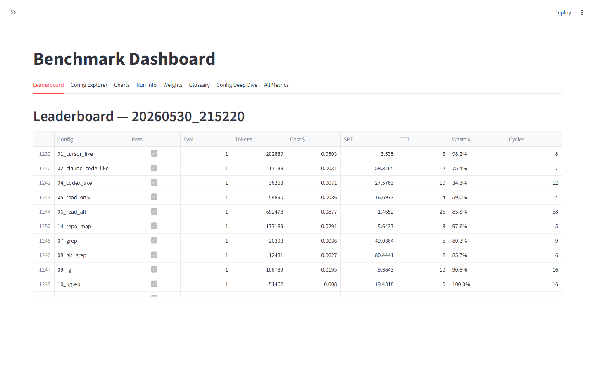
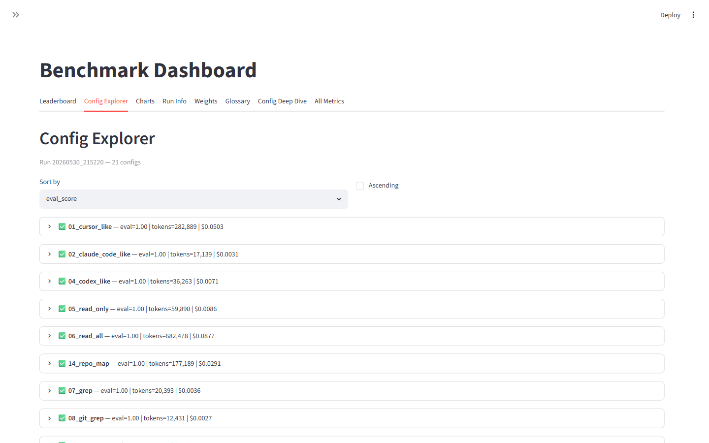
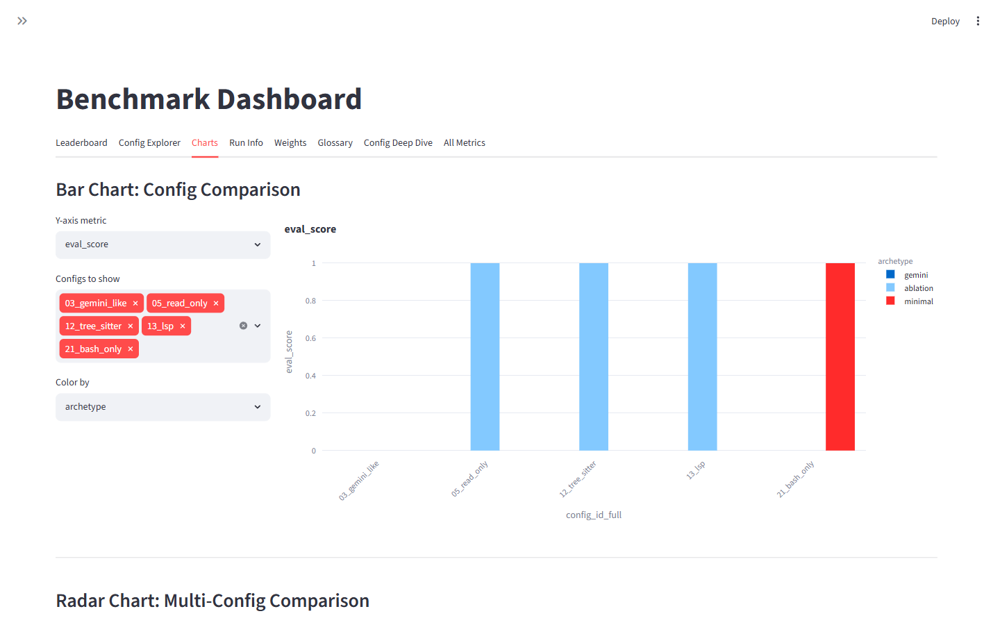
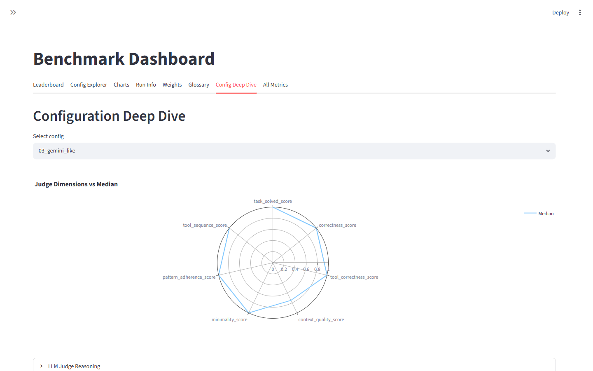
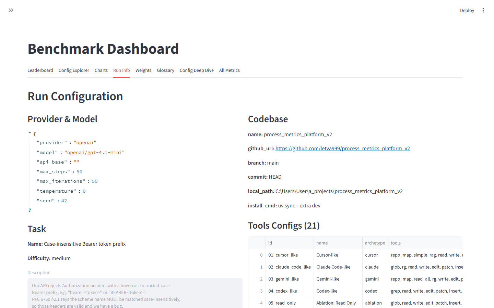
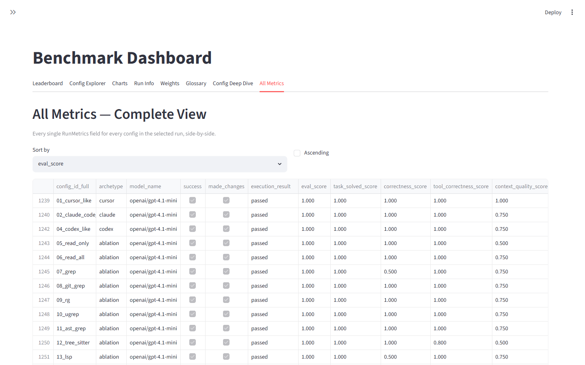

# Tools Token Economy Benchmark

**Which tool strategy lets a coding agent solve a task with the fewest tokens?**

This benchmark runs 21 tool configurations against the same coding task and measures success rate, token cost, efficiency (SPT), and 7 LLM-judge quality dimensions. All configs use the same model (`gpt-4.1-mini`) and the same task — only the available tools differ.

## Results snapshot — run 2026-05-30

20 of 21 configs passed (95%). Key findings:

| Config | Tools | Tokens | Cost $ | SPT | Waste% |
|---|---|---|---|---|---|
| **08_git_grep** | git\_grep + edit | 12,431 | **$0.0027** | **80.4** | 85.7% |
| **02_claude_code_like** | glob + rg + edit | 17,139 | $0.0031 | 58.3 | 75.4% |
| **07_grep** | grep + edit | 20,393 | $0.0036 | 49.0 | 80.3% |
| 04_codex_like | grep + read + edit | 36,263 | $0.0071 | 27.6 | 34.3% |
| 10_ugrep | ugrep + edit | 51,462 | $0.0080 | 19.4 | 100.0% |
| 05_read_only | glob + read + edit | 59,890 | $0.0086 | 16.7 | 59.0% |
| 14_repo_map | repo\_map + edit | 177,189 | $0.0291 | 5.6 | 97.6% |
| 01_cursor_like | repo\_map + RAG + shell | 282,889 | $0.0503 | 3.5 | 98.2% |
| 06_read_all | read\_all + edit | 682,478 | $0.0877 | 1.5 | 85.8% |

> **SPT** = Score Per 1K Tokens (higher = more efficient). **Waste%** = fraction of context irrelevant to the task.
> `03_gemini_like` (read\_all + repo\_map) failed — context explosion from reading the entire repo exceeded the model's usable window.

**Bottom line:** Targeted search tools (`git_grep`, `rg`, `grep`) massively outperform bulk-read strategies. The Claude Code-like toolset (glob+rg) achieves 58x better token efficiency than read\_all at 28x lower cost.

---

## Screenshots

| Leaderboard | Config Explorer |
|---|---|
|  |  |

| Charts | Config Deep Dive |
|---|---|
|  |  |

| Run Info | All Metrics |
|---|---|
|  |  |

---

## What it measures

Each run captures:

- **success** — did the agent's patch pass all tests?
- **eval\_score** — composite score (success × judge scores × efficiency penalties)
- **SPT** — `success / (total_tokens / 1000)` — the primary efficiency metric
- **Waste%** — share of context tokens that were read but not used in the final patch
- **TTT** — time-to-target: how many cycles before the agent first touched the right file
- **7 LLM-judge dimensions**: task\_solved, correctness, tool\_correctness, context\_quality, minimality, pattern\_adherence, tool\_sequence

The benchmark uses a real Go codebase ([process\_metrics\_platform\_v2](https://github.com/letya999/process_metrics_platform_v2)) and a real task: fix a case-insensitive Bearer token prefix bug. The agent must find the right function, patch it, and add a regression test — all verified by `pytest`.

---

## Quick start

### 1. Clone and enter the repo
```bash
git clone https://github.com/letya999/tools-token-economy
cd tools-token-economy
```

### 2. Configure
```bash
cp .env.example .env  # add OPENAI_API_KEY
```

### 3. Setup (checks environment, installs deps, dry-runs all 21 configs)
```bash
wsl bash -c "cd /mnt/c/path/to/tools-token-economy && uv run python main.py --setup"
```
Expected: every stage prints `[PASS]`.

### 4. Run the benchmark
```bash
wsl bash -c "cd /mnt/c/path/to/tools-token-economy && uv run python main.py"
```
Results: `results/run_TIMESTAMP_*/metrics.json`

### 5. View the dashboard
```bash
# Windows (recommended)
python -m streamlit run streamlit_app.py --server.address 127.0.0.1 --server.port 8501

# or via uv in WSL
uv run streamlit run streamlit_app.py --server.address 0.0.0.0
```
Opens at `http://localhost:8501` — 8 tabs, EN/RU language toggle.

---

## Dashboard tabs

| Tab | What you get |
|---|---|
| **Leaderboard** | Ranked table: Pass · Eval · Tokens · Cost · SPT · TTT · Waste% · Cycles |
| **Config Explorer** | Per-config expandable cards: scores + judge reasoning + code diff + agent timeline |
| **Charts** | Bar chart (any metric × configs) + Radar (up to 5 configs × 12 dimensions) |
| **Run Info** | Model, task description, codebase details, all 21 tool configs |
| **Weights** | Visual breakdown of eval and composite metric weights |
| **Glossary** | Searchable definitions for all 35 metrics and score dimensions |
| **Config Deep Dive** | Radar vs median + full judge reasoning + diff + per-step timeline |
| **All Metrics** | Every RunMetrics field for every config, sortable + statistical summary |

---

## Tool configs

21 configurations across 6 archetypes:

| Archetype | Configs | Philosophy |
|---|---|---|
| **cursor** | 01 | Repo map + RAG for broad context |
| **claude** | 02 | Glob + ripgrep for surgical search |
| **gemini** | 03 | Read all + rg (context-first) |
| **codex** | 04 | Grep + read (classic Unix) |
| **ablation** | 05–15 | One search tool at a time (glob, read\_all, grep, git\_grep, rg, ugrep, ast\_grep, tree\_sitter, LSP symbols, repo\_map, simple\_RAG) |
| **semantic** | 16–17 | Serena MCP / Semble MCP (semantic code understanding) |
| **hybrid** | 18–20 | Combinations (rg+repo\_map, rg+LSP, Serena+Semble) |
| **minimal** | 21 | Bash only — no specialised tools |

---

## Other commands

| Command | Description |
|---|---|
| `python main.py --dry-run` | Verify all 21 configs load (no API calls) |
| `python main.py --config-ids 02_claude_code_like` | Run a single config |
| `python main.py --config-ids 02,08,13` | Run specific configs |
| `python main.py --retry-failed` | Re-run only failed configs into the same results folder |
| `python main.py --runs 5` | Multi-run (p75 aggregation for statistical stability) |
| `python main.py --doctor` | Infrastructure health check |
| `python main.py --dashboard` | Generate static HTML dashboard (no server needed) |

---

## Architecture

```
src/
  core/           # Models (RunMetrics, BenchmarkMeta, AgentConfig), config loader
  features/       # Isolation, LLM judge, preflight, tool registry, metrics aggregator
  orchestrator/   # BenchmarkOrchestrator — wires everything together
configs/
  provider.yaml         # Model provider settings (model, max_steps, temperature)
  tools.yaml            # 21 tool strategies
  tasks/medium.yaml     # Task definition (description, test_cmd, required_files)
  codebase.yaml         # Target repository config
  benchmark_weights.yaml # Scoring weights
streamlit_app.py   # 8-tab interactive dashboard
results/           # Per-run output: metrics.json, agent_messages.json, final.patch
tests/             # Unit tests (pytest)
```

See [`docs/ARCHITECTURE.md`](docs/ARCHITECTURE.md) for full design details and [`AGENTS.md`](AGENTS.md) for AI agent instructions.

---

## Prerequisites

- Python 3.13+, `uv`
- WSL2 Ubuntu (agent execution runs in WSL)
- `rg` (ripgrep): `sudo apt install ripgrep`
- `OPENAI_API_KEY` in `.env`
